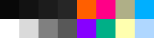

# lapland.nvim
A dark Neovim theme inspired by Lapland's fruits.

## Screenshot
<div align="center">
  
</div>

## Color Palette


## Features
* Situation-aware contrast: an element that needs more focus at the moment gets higher contrast (e.g. a PopUp menu).
* Uses pleasing colors to the eye.
* Based on a small palette (just 16 colors).
* 100% Lua code (requires Neovim v0.5.0 or higher).

## Installation
### Using [packer.nvim](https://github.com/wbthomason/packer.nvim)
```lua
-- Lua
use 'hsi/lapland.nvim'
```

### Using [Dein.vim](https://github.com/Shougo/dein.vim)
```vim
" Vimscript
call dein#add('hsi/lapland.nvim')
```

### Using [vim-plug](https://github.com/junegunn/vim-plug)
```vim
" Vimscript
Plug 'hsi/lapland.nvim'
```

## Want to help?
Feel free to open an issue or send a pull request!

## License
[Apache-2.0](https://www.apache.org/licenses/LICENSE-2.0.txt)
