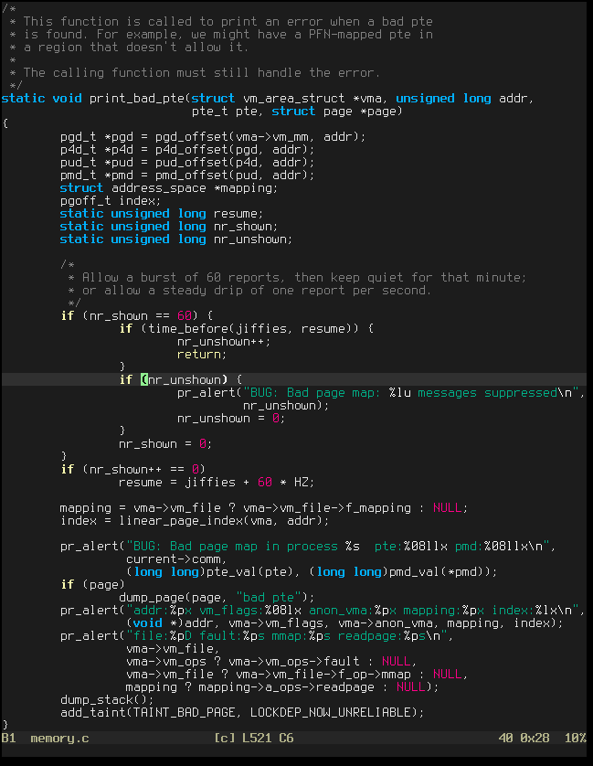
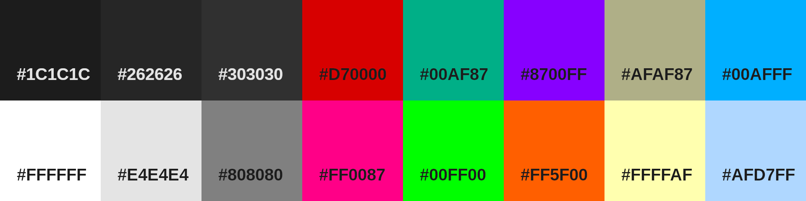

# lapland.vim
Neovim/Vim theme inspired by Lapland's fruits

Screenshot
----------

Color Palette
-------------

Features
--------
* Easy to read: more important elements have higher contrast, others are kept in the background.
* Using pleasing colors to the eye.
* Based on palette with 16 colors.
* Small and fast code.

Want to help?
-------------
Feel free to open an issue or send a pull request!

License
-------
[MIT]: https://en.wikipedia.org/wiki/MIT_License
